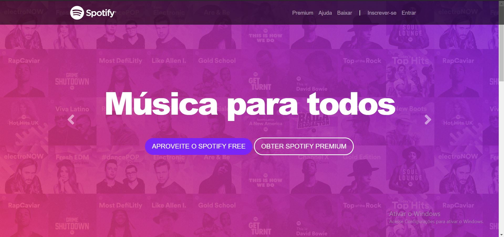

<h1 align="center">

</h1>

<h1 align="center" >Clone da home page do Spotify</h1>

## Objetivos:

Ao realizar este projeto, meu objetivo é o de estudar e aprofundar meus conhecimentos em CSS Responsivo, com uso do BootStrap.

## O que é BootStrap?
Segundo o Wikipedia: "Bootstrap é um framework web com código-fonte aberto para desenvolvimento de componentes de interface e front-end para sites e aplicações web usando HTML, CSS e JavaScript, baseado em modelos de design para a tipografia, melhorando a experiência do usuário em um site amigável e responsivo."

## Mais infos:

Acesse: <a src="https://getbootstrap.com.br/docs/4.1/getting-started/introduction/">Bootstrap - DOCUMENTAÇÃO</a>

## Prints: 

